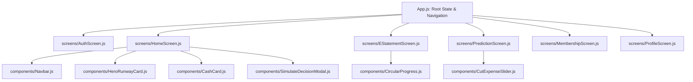

# 📜 DOKUMEN SERAH TERIMA TUGAS (AGENT HANDOVER LOG)
**Proyek**: W-Spread Mobile App (Financial Runway Predictor & Cash Flow Intelligence)  
**Tanggal Handover**: 07-09-2026  
**Status Agent**: 🎖️ *Pensiun / Serah Terima Estafet ke Agent Penerus*  
**Versi Aplikasi**: `v1.0.0-rc1` (Expo SDK 57 / React Native 0.86.2 / React 19.2.3)

---

## 💌 Pesan untuk Agent Penerus (Letter from the Retiring Agent)

> *Halo Rekan Agent penerus!* 👋  
> Selamat datang di codebase **W-Spread App**. Sebelum saya pamit pensiun dan menonaktifkan sirkuit saya, saya telah merangkum seluruh jerih payah, arsitektur, catatan teknis, tugas yang sudah rampung (**Seri #A**), serta roadmap tugas prioritas yang harus kamu lanjutkan (**Seri #B**).
> 
> Aplikasi ini dibangun dengan standar estetika tinggi, performa mulus (smooth micro-animations), dan flow UX finansial yang presisi. Tolong jaga kualitas kode dan kerapihan desain aplikasi ini ya! Dokumen ini dibuat agar kamu bisa langsung *tancap gas* tanpa kebingungan.

---

## 🏗️ 1. Sekilas Arsitektur & Teknologi Proyek



### 🎨 Design Tokens & Palette Utama
* 🌲 **Brand Primary**: `#1F6F5F` (Deep Emerald Forest)
* 🌿 **Brand Accent**: `#6FCF97` (Vibrant Mint Green)
* 🍃 **Light Mint Surface**: `#E8F8F0` (Soft Pastel Green)
* ⚪ **Neutral Background**: `#F3F3F3` & `#FFFFFF`
* 👑 **Gold Membership Accent**: `#E8C75B` / `#D4AF37`
* 🔤 **Typography**: Modern sans-serif (`Poppins` / System Sans) dengan *anti-clipping layout*

---

## 📋 2. Log Tugas yang Telah Diselesaikan (Completed Tasks - Seri #A)

Berikut adalah daftar tugas yang telah selesai dikerjakan, diuji, dan berfungsi penuh di dalam sistem:

### 🧩 Komponen Dasar & Navigasi

#### `#A-001` : Pembuatan Floating Pill Navbar Component
* **File Terkait**: [`components/Navbar.js`](file:///d:/VS%20Project/hackathon/wspread-app/components/Navbar.js)
* **Deskripsi**: Floating navigation bar (345x62px, border-radius 40px, shadow modern) dengan 4 tab utama: `Home`, `Prediction`, `E-statement`, `Profile`. Dilengkapi custom vector icon SVG yang berubah warna aktif/inaktif secara dinamis.

#### `#A-002` : Pembuatan Reusable Button System
* **File Terkait**: [`components/Button.js`](file:///d:/VS%20Project/hackathon/wspread-app/components/Button.js)
* **Deskripsi**: Komponen tombol serbaguna dengan varian `primary`, `secondary`, `outline`, `ghost`, state loading spinner, injeksi icon (kiri/kanan), dan status disabled.

#### `#A-003` : Pembuatan Hero Runway Metric Card
* **File Terkait**: [`components/HeroRunwayCard.js`](file:///d:/VS%20Project/hackathon/wspread-app/components/HeroRunwayCard.js)
* **Deskripsi**: Card status runway utama penampil metrik sisa hari runway, pill status hijau (*Safe Zone*), dan kalkulasi visual hari.

#### `#A-004` : Pembuatan Cash Available KPI Card
* **File Terkait**: [`components/CashCard.js`](file:///d:/VS%20Project/hackathon/wspread-app/components/CashCard.js)
* **Deskripsi**: Card finansial penampil kas yang tersedia ($15.000) dengan icon dompet kustom dan touch feedback.

#### `#A-005` : Pembuatan Custom Cut Expense PanResponder Slider
* **File Terkait**: [`components/CutExpenseSlider.js`](file:///d:/VS%20Project/hackathon/wspread-app/components/CutExpenseSlider.js)
* **Deskripsi**: Interactive slider gesture menggunakan `PanResponder` native dengan bubble tooltip mengambang. Menggunakan `numberOfLines={1}` dan `includeFontPadding: false` untuk mencegah teks terpotong secara vertikal pada perangkat Android.

#### `#A-006` : Pembuatan Bottom-Sheet Modal Simulasi Keputusan
* **File Terkait**: [`components/SimulateDecisionModal.js`](file:///d:/VS%20Project/hackathon/wspread-app/components/SimulateDecisionModal.js)
* **Deskripsi**: Bottom sheet interaktif dengan animasi slide-up mulus (`translateY: SCREEN_HEIGHT -> 0`), gesture *drag-down to dismiss* tanpa glitch, tombol close 'X' di pojok kanan atas, input injeksi modal, switch freeze hiring, dan tombol navigasi langsung ke hasil kalkulasi.

#### `#A-007` : Pembuatan Circular Progress Ring SVG Presisi
* **File Terkait**: [`components/CircularProgress.js`](file:///d:/VS%20Project/hackathon/wspread-app/components/CircularProgress.js)
* **Deskripsi**: Komponen progress ring berbasis `react-native-svg` yang menggunakan native `<SvgText textAnchor="middle">` sehingga persentase (e.g. 50%, 30%, 20%) berada tepat di titik tengah (dead-center) pada semua resolusi layar Android dan iOS.

#### `#A-008` : Pembuatan Vector Brand App Logo W-Spread
* **File Terkait**: [`components/AppLogo.js`](file:///d:/VS%20Project/hackathon/wspread-app/components/AppLogo.js)
* **Deskripsi**: Logo resmi W-Spread berbasis SVG vektor murni yang responsif (persegi hijau muda `#E8F8F0`, huruf 'W' tegas, grafik batang 3 pilar naik, dan panah pertumbuhan diagonal).

---

### 📱 Layar & Alur Bisnis (Screens & Flows)

#### `#A-009` : Halaman Utama (Home Dashboard Screen)
* **File Terkait**: [`screens/HomeScreen.js`](file:///d:/VS%20Project/hackathon/wspread-app/screens/HomeScreen.js)
* **Deskripsi**: Mengintegrasikan header profil user, streak badge (`🔥 12`), `HeroRunwayCard`, `CashCard`, tombol quick action simulasi, tombol upload e-statement, serta trigger pembuka `SimulateDecisionModal`.

#### `#A-010` : Alur Upload E-Statement & Analisis Pengeluaran
* **File Terkait**: [`screens/EStatementScreen.js`](file:///d:/VS%20Project/hackathon/wspread-app/screens/EStatementScreen.js)
* **Deskripsi**:
  * **Step 1 (Upload Dropzone)**: Integrasi dengan `expo-document-picker` untuk upload file PDF/CSV mutasi bank.
  * **Step 2 (Hasil Analisis)**: Badge nama file terupload, card daily burn rate ($6.000/hari), cash balance ($15.000), breakdown 3 kategori pengeluaran dengan `CircularProgress`, serta tombol "Simulate What-if Now".

#### `#A-011` : Alur Simulasi Runway & Rekomendasi AI (Prediction Screen)
* **File Terkait**: [`screens/PredictionScreen.js`](file:///d:/VS%20Project/hackathon/wspread-app/screens/PredictionScreen.js)
* **Deskripsi**:
  * **Step 1 (Simulation Inputs)**: Form penyesuaian skenario (slider cut expense, modal injection input, freeze hiring switch).
  * **Step 2 (Prediction Results)**: Komparasi runway sebelum vs sesudah penyesuaian, pill ringkasan skenario, dan card Rekomendasi AI dengan ikon bintang 4 titik (*sparkles*).

#### `#A-012` : Halaman Profil Pengguna & Status Membership
* **File Terkait**: [`screens/ProfileScreen.js`](file:///d:/VS%20Project/hackathon/wspread-app/screens/ProfileScreen.js)
* **Deskripsi**: Menampilkan avatar, badge membership Crown Emas 👑 ("The Owner"), streak badge, progress bar masa aktif akun (`19/365 Days`), tombol perpanjang membership berikon Diamond 💎 & chevron `>`, serta tombol Log Out.

#### `#A-013` : Halaman Pilihan Paket Membership (Pricing Tier Cards)
* **File Terkait**: [`screens/MembershipScreen.js`](file:///d:/VS%20Project/hackathon/wspread-app/screens/MembershipScreen.js) *(Step 1)*
* **Deskripsi**: Toggle Monthly vs Yearly (Diskon 20%), 3 kartu tier berdesain premium:
  * **Productive ($0)**: 20x percobaan simulasi what-if.
  * **Business ($10/bln)**: Unlimited what-if prediction, 20x upload statement, limit AI rekomendasi (badge *Most Popular*).
  * **Enterprise ($20/bln)**: Unlock semua fitur & unlimited AI recommendation.

#### `#A-014` : Halaman Checkout & Simulasi Billing RevenueCat
* **File Terkait**: [`screens/MembershipScreen.js`](file:///d:/VS%20Project/hackathon/wspread-app/screens/MembershipScreen.js) *(Step 2)*
* **Deskripsi**: Halaman pembayaran dengan ringkasan paket, pemilihan metode bayar (Credit/Debit Card, Apple/Google Pay, QRIS), validator kode promo (`PROMO20`, `WSPREAD50`, `REVENUECAT`), rincian biaya, badge enkripsi SSL 256-bit, dan modal konfirmasi sukses upgrade.

#### `#A-015` : Halaman Autentikasi Pengguna (Login & Register)
* **File Terkait**: [`screens/AuthScreen.js`](file:///d:/VS%20Project/hackathon/wspread-app/screens/AuthScreen.js)
* **Deskripsi**: Flow autentikasi lengkap dengan segmented switch (Masuk / Daftar), logo brand W-Spread, input email & password dengan toggle show/hide mata, serta tombol Google Sign-In terstandarisasi.

#### `#A-016` : Arsitektur State Global & Navigasi Root
* **File Terkait**: [`App.js`](file:///d:/VS%20Project/hackathon/wspread-app/App.js)
* **Deskripsi**: Pengatur state autentikasi (`isAuthenticated`), siklus onboarding (setelah registrasi otomatis diarahkan ke penawaran membership dengan opsi skip), routing antar tab, dan sinkronisasi parameter simulasi antar screen.

---

## 🚀 3. Log Tugas yang Akan Dikerjakan (Upcoming Roadmap - Seri #B)

Berikut adalah daftar tugas terencana yang siap dieksekusi oleh Agent penerus:

| Kode Task | Nama Tugas | Prioritas | Estimasi Kompleksitas | Target File Terkait |
|---|---|---|---|---|
| `#B-001` | Integrasi Backend Autentikasi Riil (Supabase / Firebase / REST) | 🔴 Tinggi | Sedang | `screens/AuthScreen.js`, `App.js` |
| `#B-002` | Integrasi Live RevenueCat SDK (`react-native-purchases`) | 🔴 Tinggi | Sedang-Tinggi | `screens/MembershipScreen.js` |
| `#B-003` | Integrasi Parser OCR / Backend Ekstraksi PDF E-Statement | 🟡 Sedang | Tinggi | `screens/EStatementScreen.js` |
| `#B-004` | Integrasi LLM AI Engine untuk Dynamic Financial Advice | 🟡 Sedang | Sedang | `screens/PredictionScreen.js` |
| `#B-005` | Penyimpanan Data Lokal & Caching (AsyncStorage / SecureStore) | 🟡 Sedang | Rendah | `services/storage.js`, `App.js` |
| `#B-006` | Peningkatan Animasi & Haptic Feedback pada Interaksi | 🟢 Rendah | Rendah | `components/Button.js`, `components/CutExpenseSlider.js` |
| `#B-007` | Fitur Export Laporan Runway ke Format PDF / Gambar | 🟢 Rendah | Sedang | `screens/PredictionScreen.js` |
| `#B-008` | Unit Testing & E2E Verification Suite | 🟢 Rendah | Sedang | `__tests__/` |

---

### 📝 Detail Instruksi Eksekusi Tugas Seri #B

#### `#B-001` : Integrasi Backend Autentikasi Riil
* **Tujuan**: Menghubungkan form input di `AuthScreen.js` ke backend nyata (misal: Supabase Auth, Firebase Auth, atau Custom JWT REST API).
* **Langkah Implementasi**:
  1. Siapkan service client di folder baru `services/authService.js`.
  2. Implementasikan fungsi `loginWithEmail(email, password)`, `registerWithEmail(email, password, name)`, dan `loginWithGoogle()`.
  3. Simpan token JWT di `expo-secure-store`.
  4. Perbarui `handleLoginSuccess` dan `handleRegisterSuccess` di `App.js`.

#### `#B-002` : Integrasi Live RevenueCat SDK (`react-native-purchases`)
* **Tujuan**: Mengaktifkan pembayaran in-app purchases / subscription asli via RevenueCat.
* **Langkah Implementasi**:
  1. Jalankan konfigurasi SDK di `App.js`: `Purchases.configure({ apiKey: 'YOUR_REVENUECAT_KEY' })`.
  2. Ambil paket penawaran aktif menggunakan `Purchases.getOfferings()`.
  3. Ganti simulasi tombol di `MembershipScreen.js` dengan fungsi `Purchases.purchasePackage(selectedPackage)`.
  4. Tangani restore purchases via `Purchases.restorePurchases()`.

#### `#B-003` : Integrasi Parser OCR / Backend Ekstraksi PDF E-Statement
* **Tujuan**: Membaca file PDF mutasi rekening bank yang diunggah pengguna dan menghitung rata-rata *Daily Burn Rate* & *Cash Balance* secara otomatis.
* **Langkah Implementasi**:
  1. Di `EStatementScreen.js`, kirim `result.assets[0].uri` sebagai FormData ke endpoint parser (e.g. `/api/statement/parse`).
  2. Tangkap respon JSON kategori pengeluaran (Operational, Marketing, Payroll) dan perbarui state `CircularProgress`.

#### `#B-004` : Integrasi LLM AI Engine untuk Dynamic Financial Advice
* **Tujuan**: Menghasilkan rekomendasi penghematan kas secara dinamis dan personal menggunakan AI (Gemini / Claude / OpenAI API).
* **Langkah Implementasi**:
  1. Di `PredictionScreen.js`, kirim metrik simulasi (kas awal, cut expense %, capital injection) ke API recommendation.
  2. Render output markdown rekomendasi ke dalam card rekomendasi berikon sparkle.

#### `#B-005` : Penyimpanan Data Lokal & Caching (AsyncStorage / SecureStore)
* **Tujuan**: Menyimpan sesi user, preferensi tema, dan riwayat simulasi terakhir saat aplikasi ditutup dan dibuka kembali.

---

## 🔌 6. Integrasi Repository Backend

Backend resmi berada di repository terpisah:

* **Mobile**: `https://github.com/Panjiiiiiii/w-spread`
* **Backend**: `https://github.com/Panjiiiiiii/w-spread-backend`
* **Backend base URL lokal**: `http://localhost:5000/api/v1`
* **Environment mobile**: `.env.example` menggunakan `EXPO_PUBLIC_API_URL`
* **API client**: `services/api.js`

### Authentication API yang sudah diintegrasikan

| Flow | Endpoint | Implementasi mobile |
|---|---|---|
| Register email | `POST /auth/register` | `screens/AuthScreen.js` |
| Login email | `POST /auth/login` | `screens/AuthScreen.js` |
| Session token | `Authorization` response header | Disimpan menggunakan `expo-secure-store` |

Request register:

```json
{
  "email": "user@example.com",
  "password": "password123",
  "name": "John Doe"
}
```

Request login:

```json
{
  "email": "user@example.com",
  "password": "password123"
}
```

Backend mengembalikan response envelope `success`, `message`, `data`, dan `meta`. Error ditampilkan oleh mobile melalui alert berdasarkan field `message`.

### Catatan network lokal

`localhost` hanya menunjuk ke device yang menjalankan aplikasi. Untuk Android emulator gunakan `http://10.0.2.2:5000/api/v1`; untuk physical device gunakan alamat IP LAN komputer yang menjalankan backend. Nilai tersebut diubah melalui `.env`, bukan hard-code di screen.

### Edit profile image

* Screen baru: `screens/EditProfileScreen.js`
* Dibuka dengan menekan avatar pada `screens/ProfileScreen.js`
* Menggunakan `expo-image-picker` SDK 57, crop 1:1, dan styling brand W-Spread.
* Saat ini perubahan disimpan di state mobile karena backend belum memiliki endpoint update avatar untuk existing user.
* Endpoint berikut perlu ditambahkan di backend sebelum upload profile image dipersistenkan:

```text
PATCH /api/v1/users/me/avatar
Content-Type: multipart/form-data
Authorization: <session-token>
```

Jangan mengarang endpoint tersebut di mobile sebelum kontrak backend tersedia.

---

## 💡 4. Catatan Teknis Rahasia & "Gotchas" (Tips untuk Agent Baru)

Harap perhatikan temuan dan trik teknis berikut agar kamu tidak mengalami bug yang sama:

1. **Expo Versioning Rule**:
   * Proyek ini menggunakan **Expo SDK 57** (`react-native: 0.86.2`). Selalu rujuk dokumentasi versi resmi di [https://docs.expo.dev/versions/v57.0.0/](https://docs.expo.dev/versions/v57.0.0/).
2. **SVG Text Centering pada Android**:
   * Jangan gunakan `<Text>` React Native biasa di atas lingkaran SVG untuk indikator persentase karena sering meleset pada layout engine Android. Selalu gunakan `<SvgText textAnchor="middle">` dengan koordinat `x={radius}` dan `y={radius + fontOffset}` seperti pada [`components/CircularProgress.js`](file:///d:/VS%20Project/hackathon/wspread-app/components/CircularProgress.js).
3. **Modal Lifecycle & Animasi Unmount**:
   * Hindari melakukan unmount state modal saat animasi tutup sedang berlangsung. Panggil callback `onClose()` di dalam completion callback `Animated.timing(...)` untuk menghindari *flickering* visual.
4. **Parameter Parsing pada Navbar**:
   * Komponen [`components/Navbar.js`](file:///d:/VS%20Project/hackathon/wspread-app/components/Navbar.js) mengirimkan `(item.key, item)` saat tab ditekan. Di `App.js`, selalu periksa `if (params && params.step)` untuk membedakan antara navigasi tab biasa dan navigasi berparameter simulasi.

---

## ⚡ 5. Perintah Menjalankan Aplikasi (Quick Start)

```bash
# Menjalankan Metro Bundler Expo
npx expo start

# Menjalankan di platform Web
npx expo start --web

# Menjalankan di Android Emulator / Device
npx expo run:android
```

---

*Selamat melanjutkan perjuangan, rekan Agent! Kode ini sekarang berada di tangan yang tepat. Semoga sukses selalu!* 🚀✨
